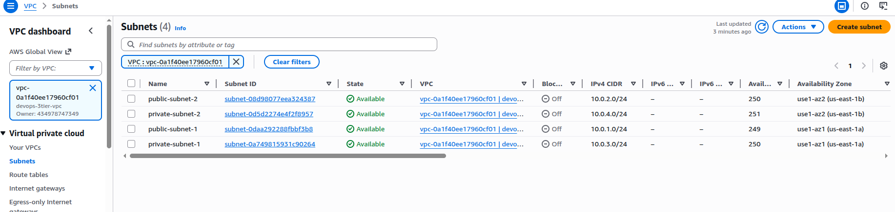
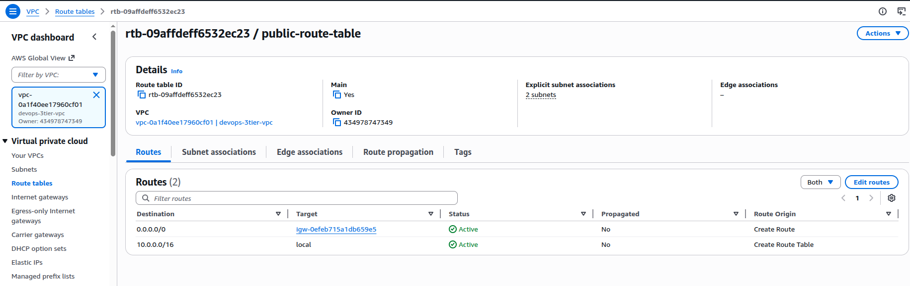
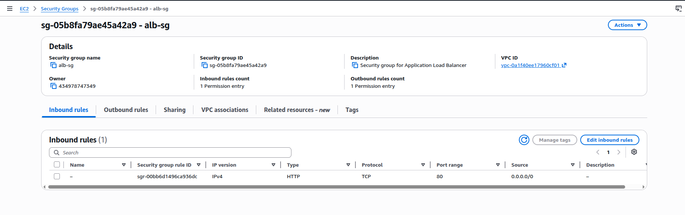
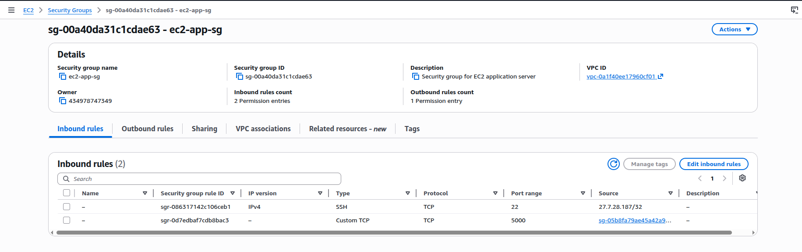
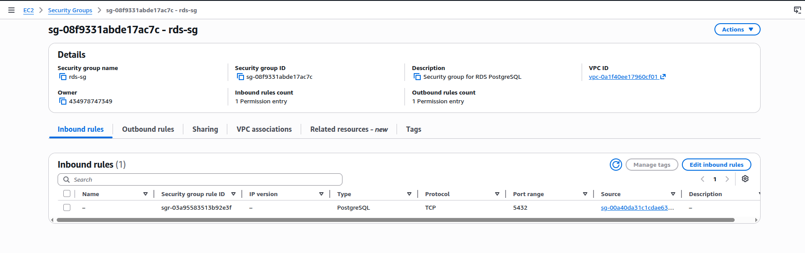
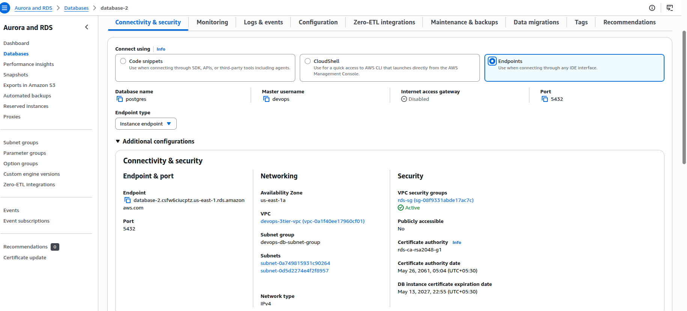
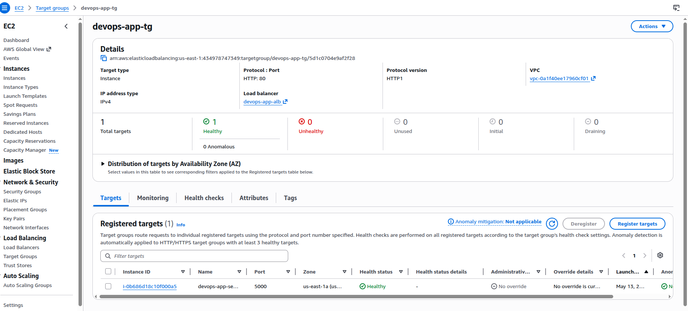
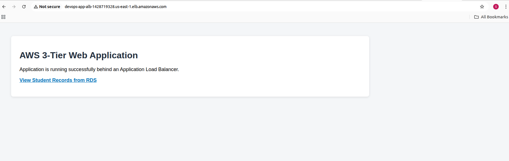
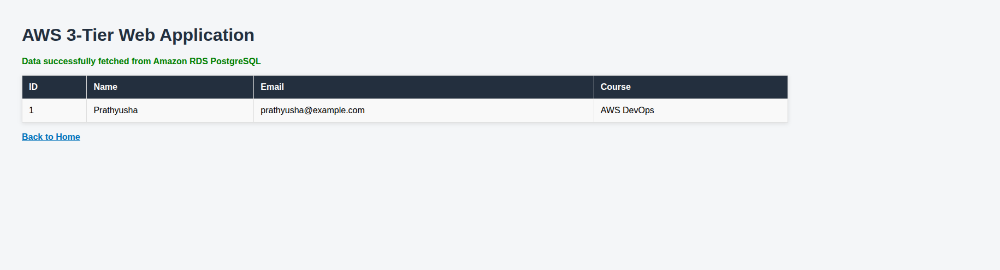

# AWS 3-Tier Web Application

## Project Overview

This project demonstrates the deployment of a 3-tier web application on AWS using EC2, Application Load Balancer, and Amazon RDS PostgreSQL.

The application is built using Python Flask and connects to a private RDS PostgreSQL database to fetch and display student records.

## Architecture

User → Application Load Balancer → EC2 Flask Application → RDS PostgreSQL

## AWS Services Used

- Amazon VPC
- Public and private subnets
- Internet Gateway
- Route Tables
- Security Groups
- EC2
- Application Load Balancer
- Target Group
- Amazon RDS PostgreSQL

## Project Flow

1. Created a custom VPC with public and private subnets.
2. Configured an Internet Gateway and route tables.
3. Launched an EC2 instance in a public subnet.
4. Created an RDS PostgreSQL database in private subnets.
5. Configured security groups for ALB, EC2, and RDS.
6. Connected EC2 to RDS using PostgreSQL client.
7. Created a students table and inserted sample data.
8. Deployed a Flask application on EC2.
9. Created a target group and Application Load Balancer.
10. Accessed the application using the ALB DNS name.

## Security Design

- ALB allows HTTP traffic from the internet on port 80.
- EC2 allows application traffic on port 5000 only from the ALB security group.
- RDS allows PostgreSQL traffic on port 5432 only from the EC2 security group.
- RDS public access is disabled.
- SSH access to EC2 is restricted.

## Screenshots

### VPC and Subnets

Created a custom VPC with public and private subnets. Public subnets are used for ALB and EC2, while private subnets are used for RDS.

### Public Route Table

Configured the public route table with an Internet Gateway route so public subnet resources can receive internet traffic.

### ALB Security Group

Allowed HTTP traffic from the internet to the Application Load Balancer.

### EC2 Security Group

Allowed SSH access and allowed application traffic on port 5000 only from the ALB security group.

### RDS Security Group

Allowed PostgreSQL traffic on port 5432 only from the EC2 security group.

### Private RDS PostgreSQL

Provisioned Amazon RDS PostgreSQL in private subnets with public access disabled.

### Target Group Healthy

Registered the EC2 instance in the target group and confirmed that the target is healthy.

### Application Home Page

Accessed the Flask application through the ALB DNS name.

### Student Records from RDS

The `/students` page fetches records from RDS PostgreSQL and displays them in the browser.

## Commands Used

See [commands.md](docs/commands.md)

## Setup Steps

See [setup-steps.md](docs/setup-steps.md)

## Troubleshooting

See [troubleshooting.md](docs/troubleshooting.md)

## Key Learnings

- Designed a basic 3-tier architecture on AWS.
- Understood public and private subnet usage.
- Configured ALB, EC2, and RDS security group flow.
- Connected EC2 to private RDS PostgreSQL.
- Deployed a Flask app on EC2.
- Routed public traffic through an Application Load Balancer.
- Troubleshot real issues such as RDS authentication, Flask dependencies, and ALB 502 errors.
